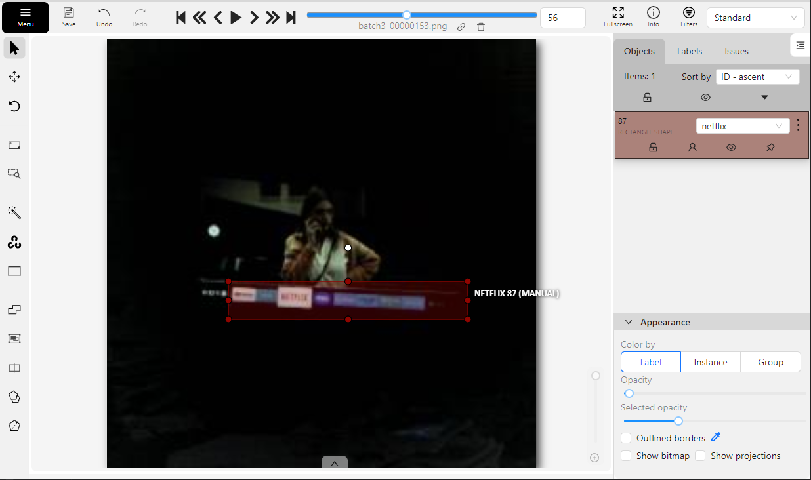

# Tv Automation

### Introduction

Older adults may find some TV remotes challenging to use due to their lack of texture and color cues. 
For example, some might know how to change TV channels but struggle to switch between apps, such as from Netflix to 
regular television. The specific issues could be:

- Identifying the buttons on the remote that allow for specific actions (e.g., opening the apps menu)
- Pressing the correct buttons (left, right, enter, etc.) to select a different app
- Determining which app is currently in use by looking at the TV and understanding the contents
- All of this at night, with low light conditions

I’ll explore a solution to these problems by:

- Using computer vision to provide feedback on the current TV state
- Using a microcontroller to send IR signals to the TV (coming soon...)

I have at hand a [JeVois-A33 "Smart Machine Vision Camera"](https://www.jevoisinc.com/products/jevois-a33-smart-machine-vision-camera) with the following high level specs:

- Processor: Quad-core ARM Cortex A7 @ 1.34GHz
- Memory: 256MB DDR3 SDRAM
- Camera: 1.3MP with various resolutions
- Storage: micro SD slot.
- USB: Mini USB for power, video streaming, and serial interface.
- Serial Port: Micro serial port for communication with controllers.

I started with a VGA (640 x 480) resolution as a baseline for my experiments. In the future, I could select up SXGA 
(1280 x 1024) to capture more details or use lower resolutions if needed. 

Here's an example of an image captured at night with low light conditions:


This image shows a Smart TV with the applications bar open at the bottom of the screen. It displays 9 applications: 
YouTube, Television, Netflix, Max, Internet, Prime, Television over Internet, a TV provider application 
and Spotify. To the left of these apps are additional icons with native TV functions, which are outside the scope of 
this experiment.

### Approaches to solve the problem

I considered these approaches:

1) Classify the entire image.
2) Use an object detector to locate the apps bar and then apply classical computer vision techniques to identify the 
selected app.
3) Use an object detector to locate the apps bar and classify the selected app from the cropped bar image.

### Early results

1) Classification of the entire image with YOLOv8 nano was ineffective.
2) YOLOv8 nano for detecting the apps bar, combined with classical techniques for identifying the selected app showed 
promising results, but encountered corner cases and growing complexity.
3) Object detection of TV apps followed by classification was inefficient in terms of computing time.

It seemed that continuing to improve solution #2 was the only way. However, I realized that object detection 
simultaneously handles both classification and detection. I had been using a single class, "TV apps," but I could also
use multiple classes—specifically, 9 different classes. So there is a 4th possible solution:

4) Object detection to simultaneously detect the TV apps bar and classify it into one of 9 different classes. 

This is what the end result looks like:

https://github.com/user-attachments/assets/aff52a3f-d1c6-4c33-8085-f6118e5dfaa2

The JeVois is connected to a laptop via USB. On the laptop, I receive the JeVois video feed using OBS Studio. All 
computer vision processing occurs on the JeVois at 1.7 FPS, with the laptop used solely for visualizing the results.

## The full object detection solution

The JeVois-A33 image comes with pre-installed and updated computer vision software, making it very easy to run code 
without the hassle of installing additional libraries. It also includes numerous computer vision examples that showcase 
its capabilities.

I’ve used YoloV5 before and liked its CLI for easy training, so I decided to try YOLOv8 for this experiment. I was 
particularly interested in its pre-trained models of different sizes and wanted to see if the smallest one (nano) would 
work with the JeVois.

Among the options to run deep learning models on the JeVois, loading an ONNX model using the OpenCV DNN module seemed 
straightforward, so I chose this approach. Although I was also interested in running TFLite models, I couldn’t quickly 
determine how to make a TFLite 2 model run on the JeVois.

These are the high level steps needed to deploy a Deep Learning object detector on the JeVois:
- Capture images
  - Capture and save images to the JeVois microSD
  - Move the images to a folder on my computer
  - Resize the images
- Annotate images:
  - Upload images to an annotation service 
  - Draw bounding boxes and assign a class to them
  - Download the annotations in the YOLO format for object detection
- Train an object detection model
- Convert the model to the ONNX format
- Load the model using the OpenCV DNN module

First, I’ll discuss the annotation software. Then, I’ll revisit the logistics of capturing images and the process of 
adding new data to the dataset.

## Using CVAT for annotating images

I explored some annotation applications like Label Studio, Roboflow and CVAT, among others. I settled on using CVAT on
my local machine due to the tons of features that it offers, how polished it is and the possibility of setting up my own
inference service to help me with further annotations down the road.

Running CVAT locally consists of cloning the repo and spawning the needed services with Docker Compose:
```
git clone git@github.com:cvat-ai/cvat.git
cd cvat
docker compose up -d
```

This is how the CVAT interface looks like:


## Training an object detection model 

Training the first model is really straightforward thanks to the YOLO training script. Instead of creating a custom 
training loop like when using raw Pytorch, it provides all the logic which includes:
- Good set of default hyperparameters
- Automatic optimizer definition: 
  - optimizer to use (SGD or AdamW when the optimizer is set to "auto")
  - initial learning rate
  - Momentum
  - definition of parameter groups with or without weight decay
  - weight decay value
- Usage of a learning rate scheduler 
- Augmentations including the new Mosaic augmentation
- Automatic handling of image sizes by resizing and letterbox padding
- Automatic selection of the optimum batch size for the available hardware

There are many features, but these are the ones that I paid attention to when inspecting the
[training code](https://github.com/ultralytics/ultralytics/blob/main/ultralytics/engine/trainer.py).

## Improving the model

Using YOLOv8 made the training extremely easy, but to further improve the model, I needed to collect more data, as I 
only had some couple hundred images and unbalanced classes. 

After trial and error, my workflow ended looking like this:

1) Capture and save images to the JeVois microSD at 480x640 size (HxW)
2) Move the images to a new folder on my computer named "Originals\BatchN"
3) Renaming them to "batchN_0000000i.png"
4) Splitting them into two different folders corresponding to train and validation subsets
5) Center-cropping to a 480x480 size, resizing to 256x256 and writing them in the corresponding Yolo folders 
`images\train`, `images\val`.
6) Uploading them to my local CVAT server as two different train and validation tasks 
7) Use my previously trained model to do automatic annotation on both subsets
8) Fix the wrong annotations
9) Download the YOLO annotations as .txt files, each named to match its corresponding image, with one line per bounding 
box, where the first number corresponds to the class of the identified object:
```
0 0.485918 0.573184 0.535430 0.131523
```
10) Re-train the object detection model using the YOLO Python module 
11) Convert the model to the ONNX format by calling the `.export` method of the created YOLO object
12) Re-create the Nuclio base image to include the new model
13) Re-create the Nuclio service so that the new image gets loaded

The non-trivial point here is #7 (alongside points 9-13), automatic annotation, which involves creating a Docker image for a prediction 
serverless service using Nuclio. This functionality is available out of the box with CVAT.

- For points #3, #4 and #5 I used custom scripts that helped me keep my data organized.

## Automatic annotation

CVAT allows you to use your own model for automatic image annotation. After training my initial YOLOv8 nano model, I 
used it to assist me with additional annotations.

CVAT uses Nuclio to create a serverless service that runs the prediction code of your choice. To run it, you need to 
spawn some additional services using Docker Compose:
```
docker compose -f docker-compose.yml -f docker-compose.dev.yml -f components/serverless/docker-compose.serverless.yml up -d --build
```

This time, I faced a line endings issue with some Git files used by the CVAT and Nuclio services. I resolved this by 
configuring Git to preserve LF line endings for downloaded files. I then deleted my existing local CVAT repository and 
cloned it again:
```
git config --global core.autocrlf input
git clone git@github.com:cvat-ai/cvat.git
git config --global core.autocrlf true  # restore the original conf 
```

This build requires more time and memory. On Windows, I allocated 6 GB of RAM to WSL2 to ensure Docker could run 
smoothly. The allocated memory can be adjusted this by modifying the `.wslconfig` file located in the user folder.
```
[wsl2]
memory=6GB
```

Finally, Nuclio was up, its UI could be accessed through `localhost:8070`:


## Deploying a function for automatic annotation
The CVAT tutorial then suggest to use the Nuclio command line `nuctl` to deploy a new function. I was having trouble 
using `nuctl` on Windows. I found that I didn't need it because I can accomplish the same using the UI.

This is what I needed to do for deploying and re-deploying a Nuclio function:
- Create a Docker image with all the dependencies needed to run the code (surprisingly, I don't need to include the inference code 
at this step).
- Reference this Docker image on a `config.yml` file that Nuclio uses. 
- Create a new Nuclio service using the UI, passing the same `config.yml` YAML file mentioned above.

- Paste the Python code that does inference in the Nuclio UI and clicking "deploy"


Nuclio uses the provided Docker image as base image when creating the image that's finally used. It does this 
transparently and adds the inference code that was provided through the UI.

To create the base image:
```
docker build -f serverless/Dockerfile -t custom_ultralytics_cpu_yolov8_nano .
```

Finally, from the CVAT UI one can do auto annotation using the model serviced by Nuclio:


(I don't know why there are two columns of classes in the above image).

## Data organization 

YOLOv8 requires that images and annotation files for object detection be organized into separate folders for training, 
validation, and testing subsets. Adding data to these folders incrementally (e.g., a few hundred new images each day) 
is straightforward, but it can be prone to errors without proper organization.

The organization of data involves the following key points:
- I want to keep the original images separated by batch (e.g. images collected on day 1, images collected on day 2, etc.)
- I intend to use the same model for automatic annotation and inference. I suspect that a model trained on 256x256 
images may perform poorly on images of their original 480x640 size, so I need to resize the images to 256x256 and move 
them to the YOLO folder.
- To avoid name conflicts when organizing images, I rename them to `batchN_0000000i.png` before placing them 
in a folder named `originals\batchN`, where `batchN` represents a set of images collected during certain period of time.
This prevents issues when multiple images with the same name are collected over several days and when downloading the 
labels from CVAT, because it doesn't allow the image names to be changed after upload.
- CVAT requires data to be split into train, validation, and test subsets at the time of upload, and this division 
cannot be changed later. This is why I split them (randomly) into these subsets beforehand.

### About resizing images
YOLOv8 can automatically resize input images and annotations to match the desired target size.
The training scheme of YOLOv8 uses square images during the training and validation steps.
This can be seen [here](https://github.com/ultralytics/ultralytics/blob/54a0494e2d2b61b73e5f583eed97b2e9dfa48919/ultralytics/engine/trainer.py#L275C9-L275C24),
where the image size is forced to be a single number that's used for both the target height and width. This target image
size [must be a multiple](https://github.com/ultralytics/ultralytics/blob/54a0494e2d2b61b73e5f583eed97b2e9dfa48919/ultralytics/utils/checks.py#L162)
of the maximum model stride, which usually is 32. 

If the original images are not square, YOLOv8 can resize them by either:
  - Stretching the image regardless of its aspect ratio to fit into a square [as seen here](https://github.com/ultralytics/ultralytics/blob/1523fa12d801df237a76a4ac1cdf59823e16a994/ultralytics/data/base.py#L166), or
  - Maintaining the aspect ratio (as seen [here](https://github.com/ultralytics/ultralytics/blob/1523fa12d801df237a76a4ac1cdf59823e16a994/ultralytics/data/base.py#L161)) and applying letterbox padding to get a square (as seen [here](https://github.com/ultralytics/ultralytics/blob/1523fa12d801df237a76a4ac1cdf59823e16a994/ultralytics/data/dataset.py#L182)
and [here](https://github.com/ultralytics/ultralytics/blob/1523fa12d801df237a76a4ac1cdf59823e16a994/ultralytics/data/augment.py#L2295)) 

If I let YOLOv8 resize my 480x640 images with a target size of 256 while preserving the aspect ratio, it will convert them
to 192x256 and then apply letterbox padding. Instead, I use center cropping followed by resizing to 256x256. This 
approach ensures that the television, which is expected to be centered, remains in a slightly larger image, preserving 
more details compared to the 192x256 version.

## Improving Deep Learning results


- While correcting automatic annotations, I noticed confusion between two apps. Both apps had similar colors, which could 
have contributed to the confusion. When I verified my previous manual annotations, I discovered one image with two 
overlapping boxes, each representing one of those classes, and another image where the annotation for app 1 was 
mistakenly labeled as app 2.

- During app transitions, icon sizes change, and I sometimes capture images of these transitions. If I can't confidently 
label an image with a specific class, I choose not to annotate it. I hope this approach helps the model avoid confusion.
However, I worry that being overly cautious—where I can still discern the app but choose not to annotate—might be 
counterproductive.

I noticed that one app was consistently misclassified. After confirming that there were no mistakes in the annotations, 
I collected additional examples of this class to help the model improve its accuracy for this specific case.
 

# Conclusion

This project showcases a practical application of computer vision to improve TV remote usability for older adults. By 
employing object detection techniques and enhancing data management practices, the solution provides precise feedback on
the current TV state and progressively refines the model's performance. Combining real-time object detection with edge 
computing, the project utilizes the JeVois-A33 camera and YOLOv8 to effectively detect and interpret TV interfaces, 
ensuring a more intuitive and accessible user experience.

# References
- https://docs.cvat.ai/docs/manual/advanced/serverless-tutorial/
- https://docs.ultralytics.com/modes/predict/#boxes
